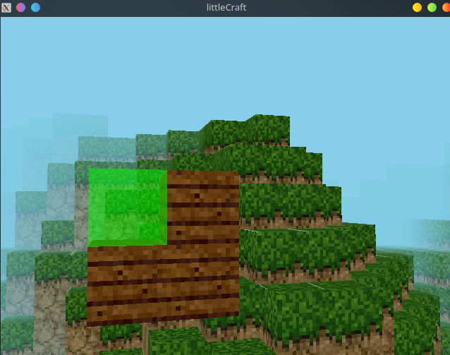

# littlecraftGL

This is the code for the second project for the Computer Graphics course at the University Of Bologna. The goal was to make an interactable 3D scene in OpenGL.
I decided to make a clone of the popular game "Minecraft", in order to challenge my knowledge and capabilities.

Some of the features of the original game are missing due to time and complexity constraints.

## Screenshots




## How to play

- Use `W,A,S,D` to fly inside the world. Use `I,J,K,L` to rotate the camera.
- You can also use your mouse to rotate the camera for precise movements, although it's a bit wonky since GLUT doesn't provide an easy way to properly handle mouse movement (es. mouse capture).
- You can press `x` for a wireframe view of the currently generated world. 
- Press `q` to remove blocks, and `e` to place a wooden plank. 

## How to compile

To compile and run in Linux, simply use the following commands:

```
cd littlecraftGL
make && ./glCraft
```

and that's pretty much it.


## Dependencies

This project uses the following libraries:

- freeGLUT - an implementation of GLUT</li>
- GLEW</li>
- glm - the openGL math library</li>
- [FastNoiseLite](https://github.com/Auburn/FastNoiseLite) - A single header lib to generate the perlin noise map

Both can be easily downloaded with `pacman` or `apt-get`.

The project also uses two additional libraries: `json.hpp` and `gltext.h`, which are both included in the project. 


## Milestones

You don't need to read any of this, I'm just using this to keep track of what I have to do.

- [x] Set up compilation enviroment on Linux
- [x] Refactor base code
- [x] Fix awful z-buffer bug (which plagued me for months)
- [x] Added Keyboard-controlled Camera
- [x] Added Quad 
- [x] Added Cube
- [x] Added Textures support
- [x] Added Cube transformations
- [x] Textured Cube
- [x] Window Resize support
- [ ] Block selection
- [x] Plain-cube floor
- [x] Noise for procedural generation
- [x] Deleting and placing cubes
- [x] Rendering optimizations
- [x] Multiple chunk management
- [ ] Water
- [x] Fog
- [ ] Cube-map
- [ ] Water reflection
- [ ] Trees?
- [ ] Gold block, silver-block 
- [ ] Shading on gold and silver blocks

## Known Issues

 - It is missing some key features, that will be added sooner or later. 
 - The code is very rough, and could use some refactoring. This is due to some GLUT quirks and the fact that some workarounds have been applied to solve some problems encountered during development. Also, I was extremely strict on time. 
 - Blocks removal is not persistent, so if you delete a cube and roam around the map, you won't be able to see the effect. 
